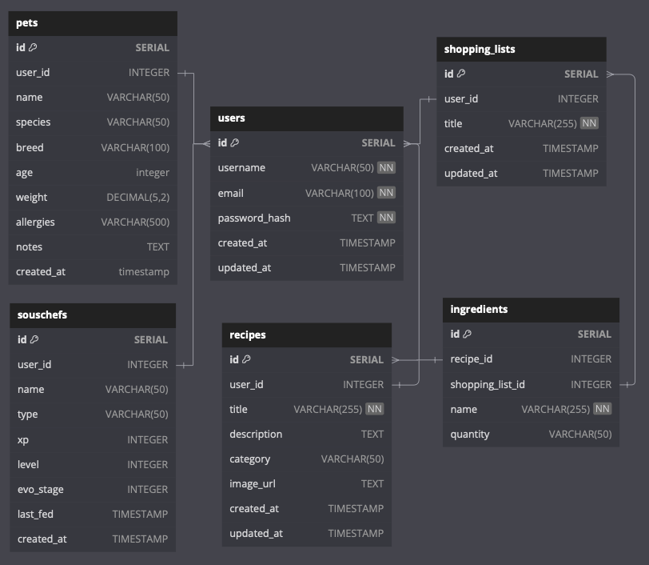

# `Feeder`

## Database Schema Design

[Feeder DB Diagram](https://dbdiagram.io/d/Feeder-67b52a3e263d6cf9a0a3f0dd)

---

## **Feeder API Documentation**

### **User Authentication & Authorization**

#### **Endpoints that Require Authentication**

All endpoints that require a current user to be logged in.

- **Request:** Requires authentication
- **Error Response:**
  - **Status Code:** 401
  - **Headers:**
    - Content-Type: `application/json`
  - **Body:**
    ```json
    {
      "message": "Authentication required"
    }
    ```

#### **Endpoints that Require Proper Authorization**

All endpoints that require authentication and the current user must have the correct permissions.

- **Request:** Requires authorization
- **Error Response:**
  - **Status Code:** 403
  - **Headers:**
    - Content-Type: `application/json`
  - **Body:**
    ```json
    {
      "message": "Forbidden"
    }
    ```

### **Users API**

#### **Get the Current User**

- **Require Authentication:** true
- **Request:**
  - **Method:** GET
  - **Route path:** `/api/users/:id`
  - **Body:** none

- **Success Response:**
  - **Status Code:** 200
  - **Body:**
    ```json
    {
      "user": {
        "id": 1,
        "username": "JohnDoe",
        "email": "johndoe@gmail.com"
      }
    }
    ```

#### **Sign Up a User**

- **Require Authentication:** false
- **Request:**
  - **Method:** POST
  - **Route path:** `/api/users`
  - **Body:**
    ```json
    {
      "username": "JohnDoe",
      "email": "johndoe@gmail.com",
      "password": "securepassword"
    }
    ```

- **Success Response:**
  - **Status Code:** 201
  - **Body:**
    ```json
    {
      "user": {
        "id": 1,
        "username": "JohnDoe",
        "email": "johndoe@gmail.com"
      }
    }
    ```

### **Recipes API**

#### **Get All Recipes**

- **Require Authentication:** false
- **Request:**
  - **Method:** GET
  - **Route path:** `/api/recipes`
  - **Body:** none

- **Success Response:**
  - **Status Code:** 200
  - **Body:**
    ```json
    {
      "recipes": [
        {
          "id": 1,
          "title": "Chicken and Rice",
          "description": "A tasty and healthy meal for pets",
          "category": "Dog Food",
          "image_url": "https://example.com/recipe1.jpg"
        }
      ]
    }
    ```

#### **Create a Recipe**

- **Require Authentication:** true
- **Request:**
  - **Method:** POST
  - **Route path:** `/api/recipes`
  - **Body:**
    ```json
    {
      "title": "Chicken and Rice",
      "description": "A tasty and healthy meal for pets",
      "category": "Dog Food",
      "image_url": "https://example.com/recipe1.jpg"
    }
    ```

- **Success Response:**
  - **Status Code:** 201
  - **Body:**
    ```json
    {
      "recipe": {
        "id": 1,
        "title": "Chicken and Rice",
        "description": "A tasty and healthy meal for pets",
        "category": "Dog Food",
        "image_url": "https://example.com/recipe1.jpg"
      }
    }
    ```

### **Shopping Lists API**

#### **Get User’s Shopping Lists**

- **Require Authentication:** true
- **Request:**
  - **Method:** GET
  - **Route path:** `/api/shopping-lists`
  - **Body:** none

- **Success Response:**
  - **Status Code:** 200
  - **Body:**
    ```json
    {
      "shopping_lists": [
        {
          "id": 1,
          "title": "Weekly Pet Groceries"
        }
      ]
    }
    ```

#### **Create a Shopping List**

- **Require Authentication:** true
- **Request:**
  - **Method:** POST
  - **Route path:** `/api/shopping-lists`
  - **Body:**
    ```json
    {
      "title": "Weekly Pet Groceries"
    }
    ```

- **Success Response:**
  - **Status Code:** 201
  - **Body:**
    ```json
    {
      "shopping_list": {
        "id": 1,
        "title": "Weekly Pet Groceries"
      }
    }
    ```

### **XP & Pet Evolution API**

#### **Get User XP & Pet Evolution**

- **Require Authentication:** true
- **Request:**
  - **Method:** GET
  - **Route path:** `/api/users/:id/xp`
  - **Body:** none

- **Success Response:**
  - **Status Code:** 200
  - **Body:**
    ```json
    {
      "xp": 200,
      "level": 3,
      "evolution_stage": "Puppy"
    }
    ```

### **Error Handling**

#### **Unauthorized Access**

- **Status Code:** 401
- **Body:**
  ```json
  {
    "message": "Authentication required"
  }
  ```

#### **Forbidden Access**

- **Status Code:** 403
- **Body:**
  ```json
  {
    "message": "Forbidden"
  }
  ```

#### **Not Found**

- **Status Code:** 404
- **Body:**
  ```json
  {
    "message": "Resource not found"
  }
  ```
